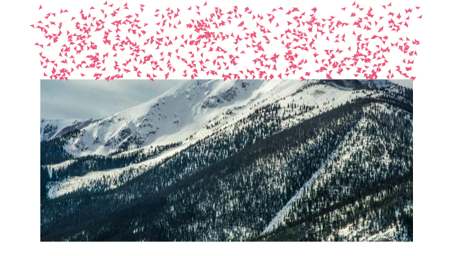

# block2particle

## 特效：点击元素粒子化



* 来源：B站up主 [欧贵姥爷啊](https://space.bilibili.com/66646023) 的 [视频](https://www.bilibili.com/video/BV18z4y1D7Zy)

## 实现技术

* canvas

* animejs

```bash
npm install animejs
```

---

## Project setup
```
npm install
```

### Compiles and hot-reloads for development
```
npm run serve
```

### Compiles and minifies for production
```
npm run build
```

### Lints and fixes files
```
npm run lint
```

### Customize configuration
See [Configuration Reference](https://cli.vuejs.org/config/).
